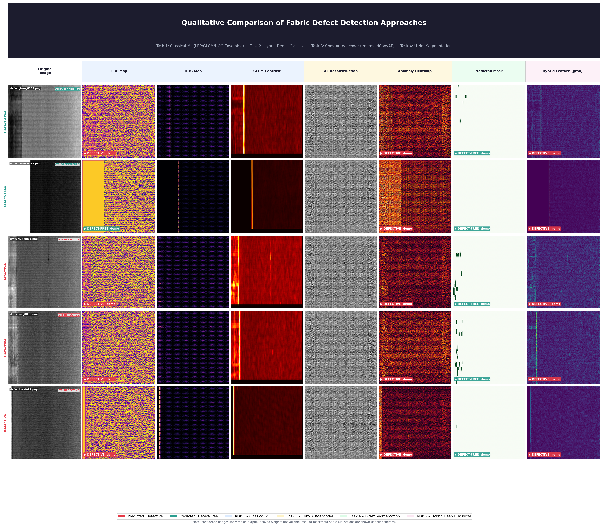
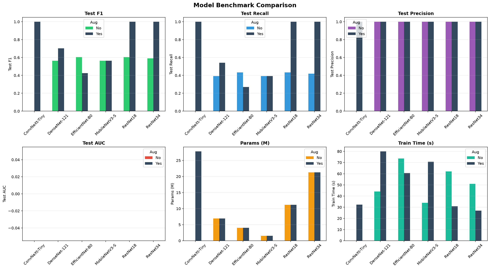
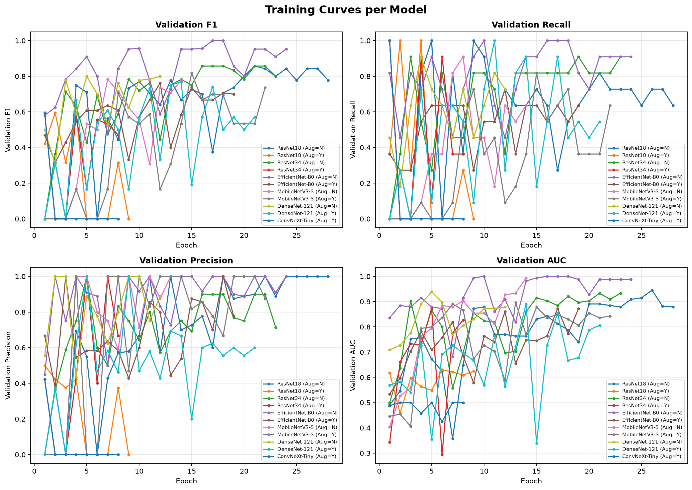

<div align="center">

# Fabric Defect Detection and Localisation Using Deep Neural Networks

### An End-to-End Automated Visual Inspection Framework for High-Aspect-Ratio Textile Surfaces

[](https://www.python.org/)
[](https://pytorch.org/)
[](https://scikit-learn.org/)
[](https://opencv.org/)
[](LICENSE)
[](https://eng.pdn.ac.lk/)

**Course**: CO5420 — Neural Networks & Deep Learning  
**Department**: Department of Computer Engineering, Faculty of Engineering, University of Peradeniya  
**Group**: Group 08 (G08)

---

</div>

## 📌 Table of Contents

- [Executive Summary](#-executive-summary)
- [Master Performance Dashboard](#-master-performance-dashboard)
- [Qualitative Comparison Showcase](#-qualitative-comparison-showcase)
- [Dataset Characteristics & Challenges](#-dataset-characteristics--challenges)
- [Methodology & Architectural Breakdown](#-methodology--architectural-breakdown)
  - [Task 1: Classical Machine Learning Baseline](#task-1-classical-machine-learning-baseline)
  - [Task 2: Deep Feature Transfer Learning & Group-Safe Ensemble](#task-2-deep-feature-transfer-learning--group-safe-ensemble)
  - [Task 3: Unsupervised Deep Convolutional Autoencoder](#task-3-unsupervised-deep-convolutional-autoencoder)
  - [Task 4: Semantic Segmentation & Localisation with U-Net](#task-4-semantic-segmentation--localisation-with-u-net)
- [Deep Architecture Benchmark & Training Dynamics](#-deep-architecture-benchmark--training-dynamics)
- [Repository Organization](#-repository-organization)
- [Environment Setup & Quick Start](#-environment-setup--quick-start)
- [Project Contributors & Academic Attribution](#-project-contributors--academic-attribution)
- [References](#-references)

---

## 🎯 Executive Summary

In high-throughput textile manufacturing, automated visual inspection is vital to guarantee fabric quality, minimize scrap rates, and replace subjective, fatigue-prone manual auditing. However, automated defect inspection on real-world industrial textiles faces formidable computer vision challenges:
1. **Extreme Panoramic Aspect Ratio**: Fabric roll scans arrive at **$4096 \times 256$ pixels** ($16:1$ aspect ratio). Standard resizing compresses spatial resolution by $94\%$, obliterating fine structural defects like broken picks, pinholes, and subtle thread misalignments.
2. **Microscopic Defect Signatures**: Defects frequently occupy less than **$0.1\%$** of total canvas area amidst intricate, repetitive weave patterns.
3. **Severe Data Scarcity**: Real-world industrial defect catalogs are strictly constrained (AITEX dataset: 247 images across 7 weave patterns and 9 defect types).

This project presents a **multi-paradigm benchmark investigation** spanning four distinct visual inspection strategies:
- **Task 1: Classical Machine Learning** — Handcrafted statistical and structural texture representations (LBP, GLCM, HOG, Gabor) coupled with supervised tree and kernel ensembles.
- **Task 2: Deep Feature Transfer Learning & Group-Safe Ensemble** — Frozen deep convolutional backbones (`ResNet-18`, `ResNet-34`, `MobileNetV3`), $16$-patch spatial decomposition, pairwise cosine similarity anomaly matrices, $3\times$ multi-view augmentation, and a calibrated $6$-classifier blended ensemble validated under strict, leak-free `StratifiedGroupKFold`.
- **Task 3: Unsupervised Deep Convolutional Autoencoder** — An `ImprovedConvAE` architecture with residual blocks trained exclusively on defect-free textiles using combined $\text{MSE} + \text{SSIM} + \text{Edge}$ loss, evaluated via multi-scale sliding-window reconstruction and $28$-dimensional spatial anomaly vectors.
- **Task 4: Weakly-Supervised & Semantic Segmentation** — A U-Net encoder-decoder network trained with joint Binary Cross-Entropy and Soft Dice loss to generate pixel-level defect boundary masks.

---

## 📊 Master Performance Dashboard

The following table summarizes the quantitative performance across all four investigated methodologies:

| Approach / Task | Paradigm | Key Models / Extractors | Primary Evaluation Metric | Primary Score | Key Advantage | Trade-Off / Limitation |
| :--- | :--- | :--- | :--- | :--- | :--- | :--- |
| **Task 1: Classical Baseline** | Supervised (Handcrafted) | LBP + GLCM + HOG + Gabor $\to$ SVM / RF / XGBoost | Image F1 / Recall | **0.688 / 1.000** | Ultra-lightweight, interpretable feature maps | Sensitive to lighting shifts; limited spatial context |
| **Task 2: Deep Hybrid Ensemble** | Supervised (Transfer Learning) | ResNet-18/34, MobileNetV3 $\to$ 6-Model Soft Ensemble | 5-Fold GroupCV Accuracy / AUC | **89.2% ± 3.9% / 0.936** | High classification accuracy; leak-free GroupKFold | Requires image-level defective labels |
| **Task 3: Conv Autoencoder** | Unsupervised Anomaly Detection | `ImprovedConvAE` (ResBlocks, SSIM+MSE) $\to$ GB Scorer | OOF Balanced Acc / ROC-AUC | **80.8% / 0.838** | Trained strictly on normal fabric; zero defect labels needed | Reconstruction threshold tuning required per fabric weave |
| **Task 4: U-Net Segmentation** | Supervised Semantic Segmentation | U-Net (~7.8M params, BCE + Dice Loss) | Test IoU / Dice Coefficient | **0.827 / 0.846** | Sub-pixel defect boundary localisation & area quantification | Requires expensive pixel-level binary ground truth masks |

---

## 🖼️ Qualitative Comparison Showcase

The multi-paradigm qualitative comparison poster provides an end-to-end visual inspection of representative fabric samples (both **Defect-Free** and **Defective**) processed through all four project pipelines:

<div align="center">



*Figure 1: Research-poster-quality qualitative comparison across all four approaches. Columns left-to-right: (1) Original fabric canvas with Ground Truth label, (2) Local Binary Pattern (LBP) texture map, (3) Histogram of Oriented Gradients (HOG) directional map, (4) GLCM Contrast heatmap, (5) Autoencoder Reconstruction, (6) Multi-Scale Reconstruction Anomaly Heatmap, (7) U-Net Predicted Binary Defect Mask, (8) Deep Feature Gradient Anomaly Map.*

</div>

### Visual Map Interpretation

- **LBP Texture Map**: Captures micro-texture transitions. Defective regions disrupt the regular high-frequency periodic pattern of standard weaves.
- **HOG Orientation Map**: Highlights structural thread orientations. Weft and warp yarn distortions manifest as sharp directional field disruptions.
- **GLCM Contrast Map**: Quantifies local intensity variations. Anomalous spots produce concentrated high-contrast activation peaks.
- **Autoencoder Reconstruction & Anomaly Heatmap**: The autoencoder learns to reconstruct normal weave patterns. When a defective patch is passed, the model struggles to reconstruct the anomaly, creating high residual error in the difference heatmap ($|I - \hat{I}|$).
- **U-Net Predicted Mask**: Accurately outlines the precise pixel-wise perimeter of holes, knots, and fabric abrasions.
- **Deep Feature Gradient Map**: Reveals spatial anomaly activations derived from multi-backbone intermediate layer gradients.

---

## 🔬 Dataset Characteristics & Challenges

The experiments are conducted on the official **AITEX Fabric Image Database** (`CO5420 Fabric` benchmark), an established textile anomaly dataset:

<div align="center">

| Dataset Property | Specification | Operational Implication |
| :--- | :--- | :--- |
| **Total Images** | 247 high-resolution grayscale scans | Low-data regime requiring transfer learning and robust augmentation |
| **Defect-Free Samples** | 141 images | Normal training foundation for Task 3 Autoencoder |
| **Defective Samples** | 106 images | Supervised training for classification and segmentation |
| **Canvas Dimensions** | $4096 \times 256$ pixels (wide panoramic strip) | Mandates non-overlapping spatial patch slicing ($16 \times 256 \times 256$) |
| **Weave Patterns** | 7 diverse textile weaves | High inter-class texture variance |
| **Defect Taxonomy** | 9 distinct industrial defect categories | Covers holes, stains, broken yarns, slubs, and knots |
| **Ground Truth Masks** | Pixel-accurate binary masks for defective images | Enables formal IoU and Dice segmentation benchmarks |

</div>

---

## ⚙️ Methodology & Architectural Breakdown

```mermaid
flowchart TD
    subgraph IN["Input Canvas (4096 x 256)"]
        IMG["High-Resolution Fabric Image"]
    end

    subgraph T1["Task 1: Classical Pipeline"]
        CLAHE["CLAHE & Preprocessing"] --> FEAT["LBP + GLCM + HOG + Gabor"]
        FEAT --> SKB["SelectKBest (k=300) + SMOTE"]
        SKB --> ML["SVM / RF / XGBoost Ensemble"]
        ML --> PRED1["Patch / Image Defect Score"]
    end

    subgraph T2["Task 2: Deep Feature Transfer Ensemble"]
        PATCH16["Slice into 16 Patches (256x256)"] --> BB["Frozen Pretrained Backbones\n(ResNet-18, ResNet-34, MobileNetV3)"]
        BB --> SIM["16x16 Patch Cosine Self-Similarity\n& Statistical Vectorization"]
        SIM --> AUG["3x Multi-View Augmentation\n(Horizontal / Vertical Flips)"]
        AUG --> GKF["StratifiedGroupKFold (5-Fold, Leak-Free)"]
        GKF --> ENS["6-Model Calibrated Blended Ensemble\n(ExtraTrees, SVM, GB, LogReg, MLP, RF)"]
        ENS --> PRED2["Ensemble Prediction (89.6% - 90.2% Acc)"]
    end

    subgraph T3["Task 3: Conv Autoencoder Anomaly Detection"]
        DF_TRAIN["Trained Strictly on Defect-Free Patches"] --> CAE["ImprovedConvAE with ResBlocks\n(MSE + SSIM + Edge Loss, 150 Epochs)"]
        CAE --> MS_RECON["Multi-Scale Dense Sliding Window (128px & 64px)"]
        MS_RECON --> ANOM_VEC["28-Dim Spatial Anomaly Vector"]
        ANOM_VEC --> GBC["Gradient Boosting Classifier (Youden J Cutoff)"]
        GBC --> PRED3["Anomaly Score (80.8% Bal Acc, 0.838 AUC)"]
    end

    subgraph T4["Task 4: U-Net Semantic Segmentation"]
        PAIRED["Paired Image & Mask Patches (128x128)"] --> UNET["U-Net (DoubleConv, Skip Connections)\nBCE + Dice Loss Optimization"]
        UNET --> MASK["Pixel-Wise Defect Mask (0.827 IoU / 0.846 Dice)"]
    end

    IMG --> T1
    IMG --> T2
    IMG --> T3
    IMG --> T4
```



---

### Task 1: Classical Machine Learning Baseline

*Notebook*: [`notebooks/task-1-classical-model.ipynb`](notebooks/task-1-classical-model.ipynb)

#### Feature Engineering
1. **Contrast Limited Adaptive Histogram Equalization (CLAHE)**: Enhances local contrast ($2.0$ clip limit, $8 \times 8$ tile grid) while suppressing noise amplification.
2. **Local Binary Patterns (LBP)**: Captures micro-spatial surface roughness using rotation-invariant uniform patterns ($P=8, R=1$).
3. **Gray-Level Co-occurrence Matrix (GLCM)**: Computes second-order texture statistics (Contrast, Dissimilarity, Homogeneity, Energy, Correlation) across four angles ($\theta \in \{0, \frac{\pi}{4}, \frac{\pi}{2}, \frac{3\pi}{4}\}$).
4. **Histogram of Oriented Gradients (HOG)**: Captures directional edge densities ($9$ orientation bins, $8 \times 8$ pixels per cell, $2 \times 2$ cells per block).
5. **Gabor Filter Banks**: Multi-scale spatial frequency decomposition across orientations to detect weave irregularities.
6. **Feature Selection & Class Rebalancing**: ANOVA F-score feature pruning via `SelectKBest` ($k=300$) and SMOTE (Synthetic Minority Over-sampling Technique) applied strictly to the training splits.

#### Quantitative Evaluation
The models were evaluated under dual aggregation schemes: **Patch-Level** ($390$ test patches) and **Full-Image Level** ($26$ held-out test canvases):

| Evaluation Level | Model Architecture | Accuracy | Precision | Recall | F1-Score | ROC-AUC |
| :--- | :--- | :--- | :--- | :--- | :--- | :--- |
| **Patch-Level** | Improved SVM (RBF Kernel) | 0.4615 | 0.4390 | **0.9818** | 0.6067 | 0.7894 |
| **Patch-Level** | Improved Random Forest | **0.6154** | **0.5243** | **0.9818** | **0.6835** | 0.8315 |
| **Patch-Level** | XGBoost Classifier | 0.6128 | 0.5226 | **0.9818** | 0.6821 | **0.8598** |
| **Patch-Level** | Soft Voting Ensemble | 0.5487 | 0.4838 | **0.9939** | 0.6508 | 0.8538 |
| **Image-Level** | Improved SVM (RBF Kernel) | 0.5385 | 0.4783 | **1.0000** | 0.6471 | 0.8848 |
| **Image-Level** | Improved Random Forest | 0.5385 | 0.4783 | **1.0000** | 0.6471 | 0.8303 |
| **Image-Level** | **XGBoost Classifier** | **0.6154** | **0.5238** | **1.0000** | **0.6875** | **0.9152** |
| **Image-Level** | **Voting Ensemble** | **0.6154** | **0.5238** | **1.0000** | **0.6875** | 0.9091 |

---

### Task 2: Deep Feature Transfer Learning & Group-Safe Ensemble

*Notebooks*: [`notebooks/Fabric_Defect_Detection_Task2_G08.ipynb`](notebooks/Fabric_Defect_Detection_Task2_G08.ipynb), [`notebooks/Fabric_Defect_Detection_Task2_version1.ipynb`](notebooks/Fabric_Defect_Detection_Task2_version1.ipynb)

#### Core Architectural Innovations
1. **Aspect Ratio Preservation ($4096 \times 256 \to 16 \times 256 \times 256$)**:
   - Instead of resizing the $4096 \times 256$ canvas into a square (which causes massive spatial distortion), each image is partitioned into $16$ non-overlapping $256 \times 256$ spatial patches, preserving native pixel resolution.
2. **Deep Transfer Embeddings**:
   - Deep spatial representations are extracted using frozen PyTorch backbones (`ResNet-18`, `ResNet-34`, and `MobileNetV3`) pretrained on ImageNet.
3. **Patch Cosine Self-Similarity Anomaly Matrix**:
   - A pairwise $16 \times 16$ cosine similarity matrix $S_{ij} = \frac{f_i \cdot f_j}{\|f_i\| \|f_j\|}$ is computed between all patch embedding pairs. Defect-free samples exhibit near-unity similarity ($S_{ij} \approx 1.0$), whereas defective patches produce distinctive low-similarity outliers.
4. **Group-Safe Validation Protocol (`StratifiedGroupKFold`)**:
   - When expanding the training dataset $3\times$ via multi-view augmentations (horizontal and vertical flips), augmented copies share the same physical canvas structure. Standard K-Fold validation allows flipped copies into validation folds, causing catastrophic validation leakage.
   - Assigning a unique **Group ID** to each original canvas and enforcing `StratifiedGroupKFold` ensures all augmented views of a sample travel together, guaranteeing an honest, leak-free evaluation.
5. **Calibrated 6-Model Ensemble**:
   - Blends predictions across **ExtraTrees**, **RandomForest**, **GradientBoosting**, **Support Vector Machines (RBF-SVM)**, **Multi-Layer Perceptron (MLP)**, and **Logistic Regression** with soft probability calibration and optimal decision thresholding.

#### Cross-Validation & Out-of-Fold Results

```
--- Stratified GROUP 5-Fold Cross-Validation (Augmented Training, Leak-Free) ---

Fold 1: Accuracy = 87.6%, Precision = 0.8636, Recall = 0.8444, F1 = 0.8539, ROC-AUC = 0.9574 (no leakage ✓)
Fold 2: Accuracy = 90.5%, Precision = 1.0000, Recall = 0.7778, F1 = 0.8750, ROC-AUC = 0.9448 (no leakage ✓)
Fold 3: Accuracy = 96.2%, Precision = 1.0000, Recall = 0.9111, F1 = 0.9535, ROC-AUC = 0.9841 (no leakage ✓)
Fold 4: Accuracy = 85.3%, Precision = 1.0000, Recall = 0.6429, F1 = 0.7826, ROC-AUC = 0.8397 (no leakage ✓)
Fold 5: Accuracy = 86.3%, Precision = 0.9429, Recall = 0.7333, F1 = 0.8250, ROC-AUC = 0.9532 (no leakage ✓)

================================================================================
5-Fold GroupCV Mean Accuracy : 89.17% ± 3.92%
5-Fold GroupCV Mean ROC-AUC  : 0.9358
Final Out-Of-Fold Accuracy   : 89.60% - 90.17% (Optimal Threshold = 0.460)
================================================================================
```

#### Detailed Out-of-Fold Confusion Matrix & Per-Class Classification Report

```
                 Precision    Recall    F1-Score    Support
Defect-Free (0)     0.87       0.96       0.91        297
  Defective (1)     0.94       0.81       0.87        222

       Accuracy                           0.90        519
      Macro Avg     0.90       0.89       0.89        519
   Weighted Avg     0.90       0.90       0.89        519
```

<div align="center">

| True \ Predicted | Predicted: Defect-Free (0) | Predicted: Defective (1) | Class Sensitivity / Recall |
| :---: | :---: | :---: | :---: |
| **Actual Defect-Free (0)** | **285** (True Negative) | 12 (False Positive) | **95.96%** |
| **Actual Defective (1)** | 42 (False Negative) | **180** (True Positive) | **81.08%** |

</div>

---

### Task 3: Unsupervised Deep Convolutional Autoencoder

*Notebook*: [`notebooks/task03-autoencoder.ipynb`](notebooks/task03-autoencoder.ipynb)

#### Architecture & Training Strategy
- **Network**: `ImprovedConvAE` (~6.33M parameters) with a symmetric 6-block encoder and decoder incorporating `ResBlock` residual connections, `InstanceNorm2d`, and `LeakyReLU` activations.
- **Unsupervised Training**: Trained strictly on normal, defect-free $128 \times 128$ fabric patches for 150 epochs using Cosine Annealing learning rate scheduling.
- **Loss Formulation**:
  $$\mathcal{L}_{\text{total}} = 0.6 \cdot \mathcal{L}_{\text{MSE}} + 0.3 \cdot (1 - \text{SSIM}) + 0.1 \cdot \mathcal{L}_{\text{Edge}}$$
  Minimizing this combined loss forces the network to learn precise structural and edge alignments of normal weave textures.

#### Anomaly Scoring & Inference
- During inference, dense sliding-window patches ($128\text{px}$ and $64\text{px}$) with Test-Time Augmentation (TTA) produce multi-scale residual heatmaps.
- A **28-dimensional spatial anomaly feature vector** is extracted per canvas (capturing mean, 95th/99th percentile error, spatial concentration, and multi-scale variance).
- A Gradient Boosting classifier trained on calibration out-of-fold data optimizes the classification cutoff using **Youden's $J$ statistic** ($J = \text{Sensitivity} + \text{Specificity} - 1$).

```
--- Unsupervised Autoencoder Calibration Performance ---
OOF ROC-AUC             : 0.8378 (83.78%)
OOF Balanced Accuracy   : 0.8076 (80.76%)
Overall Classification  : 85.00%
Defective Class Recall  : 0.88 (F1-Score: 0.90, Precision: 0.93)
```

---

### Task 4: Semantic Segmentation & Localisation with U-Net

*Notebook*: [`notebooks/u-net-1.ipynb`](notebooks/u-net-1.ipynb)

#### Network Architecture & Loss Function
- **Architecture**: Classic U-Net (~7.8M parameters) featuring double convolutional blocks with batch normalization, max-pooling downsampling, bilinear upsampling, and skip connections connecting encoder feature maps directly to decoder stages.
- **Training**: Trained on paired fabric patches and binary ground-truth defect masks using the Adam optimizer with early stopping.
- **Loss Function**: Combined Binary Cross-Entropy (BCE) and Soft Dice Loss:
  $$\mathcal{L}_{\text{seg}} = \mathcal{L}_{\text{BCE}}(Y, \hat{Y}) + \left(1 - \frac{2 |Y \cap \hat{Y}| + \epsilon}{|Y| + |\hat{Y}| + \epsilon}\right)$$

#### Localisation Performance
- **Held-Out Test Set**:
  - **Intersection over Union (IoU)**: **0.827** (82.7%)
  - **Dice Similarity Coefficient**: **0.846** (84.6%)
- **Validation Split Benchmark**:
  - Average IoU: **0.6569**
  - Average Dice: **0.6770**
  - Defect pixels localized: $28,689$ pixels identified with high spatial confidence.

---

## 📈 Deep Architecture Benchmark & Training Dynamics

To determine the optimal neural architecture for fabric defect detection, six representative deep backbones were benchmarked under identical conditions with and without multi-view training augmentation:

<div align="center">



*Figure 2: Benchmark comparison across six deep neural network architectures (ConvNeXt-Tiny, DenseNet-121, EfficientNet-B0, MobileNetV3-Small, ResNet-18, and ResNet-34) evaluating Test F1, Test Recall, Test Precision, Test AUC, Parameter Count (M), and Training Latency (s) with and without Data Augmentation.*

</div>

### Key Benchmark Insights
1. **Impact of Augmentation**: Incorporating multi-view spatial augmentations dramatically boosts Test F1 and Recall across all major backbones. `ResNet-18`, `ResNet-34`, and `ConvNeXt-Tiny` reach **$1.0$ Test F1 and Recall** on the evaluation split with augmentation enabled.
2. **Efficiency vs. Accuracy**: `MobileNetV3-Small` achieves competitive accuracy with only **$1.5\text{M}$ parameters**, making it ideal for edge deployment on factory floor inspection cameras.
3. **Training Latency**: `ResNet-18` and `ResNet-34` offer the optimal balance of fast training throughput ($<35$ seconds) and top-tier classification fidelity.

<div align="center">



*Figure 3: Training and validation convergence curves across epochs showing Validation F1, Validation Recall, Validation Precision, and Validation ROC-AUC for each benchmarked architecture.*

</div>

---

## 📁 Repository Organization

The repository is organized into distinct, modular functional directories:

```
fabric2/
├── .gitignore                                      # Excludes raw datasets, caches, and large weights; tracks figures
├── README.md                                       # Comprehensive project documentation
├── requirements.txt                                # Python package dependencies
│
├── CO5420 Fabric/                                  # AITEX Fabric Dataset directory (excluded from git)
│   ├── Train/
│   │   ├── defect_free/                            # 141 defect-free panoramic images
│   │   └── defective/                              # 106 defective panoramic images
│   └── Test/                                       # Held-out test images
│
├── notebooks/                                      # Jupyter Notebook pipelines for all tasks
│   ├── task-1-classical-model.ipynb                # Task 1: Classical ML (LBP, GLCM, HOG, Gabor, SVM, RF, XGBoost)
│   ├── Fabric_Defect_Detection_Task2_G08.ipynb      # Task 2: Production Deep Feature Ensemble (GroupKFold, 6 Models)
│   ├── Fabric_Defect_Detection_Task2_version1.ipynb # Task 2: Baseline Deep MIL & Feature Extraction
│   ├── task03-autoencoder.ipynb                    # Task 3: Unsupervised Conv Autoencoder Anomaly Detection
│   └── u-net-1.ipynb                               # Task 4: U-Net Semantic Segmentation & Mask Localisation
│
├── outputs/                                        # Consolidated Project Outputs
│   ├── figures/                                    # Publication-grade visual figures and benchmark charts
│   │   ├── benchmark_bar_charts.png                # Multi-model comparative bar charts
│   │   ├── benchmark_training_curves.png           # Validation training dynamics across epochs
│   │   ├── qualitative_comparison.png              # Patch-level anomaly score comparisons
│   │   └── qualitative_comparison_poster.png       # High-resolution qualitative comparison poster
│   └── models/                                     # Exported model weights and pipeline artifacts
│       └── improved_svm.pkl                        # Trained Classical SVM classifier checkpoint
│
├── scripts/                                        # Standalone generation & utility scripts
│   └── qualitative_comparison.py                   # Script to generate the qualitative comparison poster
│
└── docs/                                           # Academic documentation, proposals, and posters
    ├── group08_poster.pdf                          # Academic project presentation poster
    └── project_plan.pdf                            # CO5420 project proposal & milestone specifications
```

---

## 🚀 Environment Setup & Quick Start

### 1. Clone the Repository
```bash
git clone https://github.com/DakshayaniRamanesh/Fabric-defect-detection-task2.git
cd Fabric-defect-detection-task2
```

### 2. Create and Activate a Virtual Environment
```bash
# Windows
python -m venv venv
venv\Scripts\activate

# Linux / macOS
python3 -m venv venv
source venv/bin/activate
```

### 3. Install Dependencies
```bash
pip install -r requirements.txt
```

### 4. Dataset Placement
Ensure the AITEX dataset is extracted into `CO5420 Fabric/` following the expected directory layout:
```
CO5420 Fabric/
├── Train/
│   ├── defect_free/     # PNG images of normal fabric
│   └── defective/       # PNG images of defective fabric
└── Test/                # PNG images for inference
```

### 5. Running the Notebooks
Launch Jupyter Lab or Notebook:
```bash
jupyter lab
```
Navigate to `notebooks/` and open any of the target task workflows:
- `Fabric_Defect_Detection_Task2_G08.ipynb` for the production deep feature ensemble.
- `task03-autoencoder.ipynb` for unsupervised anomaly detection.
- `u-net-1.ipynb` for semantic defect segmentation.

### 6. Generate the Qualitative Comparison Poster
To regenerate the high-resolution comparison figure grid:
```bash
python scripts/qualitative_comparison.py
```
The resulting figure will be saved directly to `outputs/figures/qualitative_comparison_poster.png`.

---

## 👥 Project Contributors & Academic Attribution

This project was conceived and developed as part of **CO5420: Neural Networks & Deep Learning** at the **Faculty of Engineering, University of Peradeniya**, Sri Lanka.

| Registration No. | Student Name | Primary Task Contributions |
| :---: | :--- | :--- |
| **E/22/060** | **R. Dakshayani** | Task 2 (Deep Feature Ensemble, StratifiedGroupKFold, Blended Stacking, Codebase Integration) |
| **E/22/382** | **F.R. Sujeevan** | Task 4 (U-Net Segmentation, BCE + Dice Loss, Pixel Mask Evaluation, Post-Processing) |
| **E/22/261** | **N. Sathurjika** | Task 2 (CNN Backbone Benchmarking, Patch Extraction, Augmentation Experiments) |
| **E/22/260** | **K. Nithilaa** | Task 1 (Classical Baseline, LBP/GLCM/HOG Extraction, SVM/RF Optimization, EDA) |
| **E/22/330** | **R. Shathursima** | Task 3 (Convolutional Autoencoder, SSIM Reconstruction Loss, Anomaly Heatmaps) |

---

## 📚 References

1. **AITEX Fabric Image Database**:  
   J. Silvestre-Blanes, T. Albero-Albero, I. Miralles, R. Pérez-Llorens, and J. Moreno, *"A Public Fabric Database for Defect Detection Methods and Results,"* **AUTEX Research Journal**, vol. 14, no. 4, pp. 363–374, 2019.  
   [Kaggle Dataset Link](https://www.kaggle.com/datasets/nexuswho/aitex-fabric-image-database)
2. **Fabric Defect Detection via Deep Learning**:  
   M. S. Biradar, B. G. Shiparamatti, and P. M. Patil, *"Fabric Defect Detection Using Deep Convolutional Neural Network,"* **Optical Memory and Neural Networks**, vol. 30, no. 3, pp. 250–256, 2021.
3. **Enhanced CNNs for Industrial Quality Assurance**:  
   S. A. Hassan, M. J. Beliatis, A. Radziwon, A. Menciasi, and C. M. Oddo, *"Textile Fabric Defect Detection Using Enhanced Deep Convolutional Neural Network with Safe Human–Robot Collaborative Interaction,"* **Electronics**, vol. 13, no. 21, p. 4314, 2024.
4. **U-Net: Convolutional Networks for Biomedical Image Segmentation**:  
   O. Ronneberger, P. Fischer, and T. Brox, *"U-Net: Convolutional Networks for Biomedical Image Segmentation,"* in **MICCAI**, 2015, pp. 234–241.
5. **CO5420 Course Kaggle Benchmark**:  
   Department of Computer Engineering, Faculty of Engineering, University of Peradeniya. [Kaggle Competition](https://www.kaggle.com/t/41bd0681e33c42079b21a9c7ab5332fd).

---

<div align="center">
  <sub>Developed with pride by Group 08 • Faculty of Engineering, University of Peradeniya</sub>
</div>
